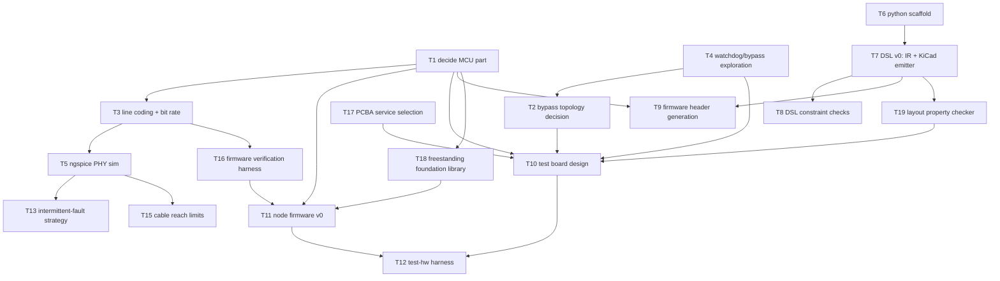

# KANBAN

The **single home for planned work** — the execution view over oparroy's
planning. Each card carries its own description; IDEAS.md is the
not-yet-ready stash, and DESIGN.md holds settled design decisions and
open design questions. When ordering matters, KANBAN wins.

Dormant in spirit until the project opens up, but cards are written in
final form from day one so pickup works the same then as now.

Each card is a **vertical slice** — thin end-to-end through the layers it
touches (DSL → firmware → board → test), completable as one change.
Cards that aren't slices (a DESIGN decision, research, a chore) carry a
**`Shape:`** tag so the picker knows.

## How to pick up work

1. Take the top card in **Next** that fits your context. Next is the set
   of cards with no unbuilt blockers; within Next, higher = higher
   leverage.
2. The change that ships a card **deletes the card** from this file —
   shipped cards are dropped, not moved into a Done column (git history
   is the durable archive). There is no In Progress column either.
3. On shipping, promote any newly-unblocked Backlog card into **Next**.

**If a card grows beyond one change, split it first** (T##a, T##b, …).
Never leave a card half-landed.

## Dependency graph

Critical paths only — every card also carries its own
`Blocked by:`/`Unblocks:`.

---

## Next

- **T1 — Decide the MCU part.** *Shape: decision.* Inputs:
  docs/mcu-research-2026-09-26.md (CH32V003 leads at ~$0.10–0.15 with
  comparator→timer-capture routing; RP2040 PIO ideal but ~3× budget —
  likely supervisor instead; recalled Silabs part ≈ EFM8BB1 at
  launch-era pricing), the owner's recollection of the sub-3-NOK Silabs
  part, and §5 of DESIGN.md (requirements incl. the node I/O
  complement: ADC, key-matrix GPIO, capsense, I2C, PWM). Note the §8
  consequence: the freestanding-C++ decision needs GCC/clang, which all
  but rules out 8051-class parts (SDCC is C-only) — the recalled Silabs
  part only survives if the firmware language is revisited. Output:
  node part + supervisor part recorded in DESIGN.md §5, toolchain
  decision with them. **Blocked by:** — · **Unblocks:** T3, T9, T10,
  T11
- **T4 — Explore node watchdog/bypass circuits.** The two candidates in
  DESIGN.md §4 — normally-on analog switch held open by MCU-driven
  charge pump vs window-watchdog supervisor IC — each captured as a
  **standalone subcircuit file with ngspice simulation unit tests**
  (DESIGN.md §7: bypass-engage timing, single-missed-pulse tolerance,
  glitch immunity). Output: subcircuits + passing sim tests + a
  recommendation in DESIGN.md §4. **Blocked by:** — · **Unblocks:**
  T2, T10
- **T6 — Python package scaffold.** uv project, Python 3.13, ruff in
  strict rule selection, ty, pytest, `src/oparroy/` layout. No DSL code
  yet — just the harness it will grow in. *Shape: tooling.* **Blocked
  by:** — · **Unblocks:** T7
- **T17 — Select the prototype PCBA service and survey its inventory.**
  *Shape: decision.* Seeed Fusion (owner's starting point) vs JLCPCB
  and peers: assembly pricing for 2-off boards, parts-library coverage
  for the cheap parts this project favors (CH32V003, analog switches,
  connectors), setup fees for non-library parts. Output: assembler
  recorded in DESIGN.md §6 + an inventory snapshot feeding the DSL
  parts DB's stock-status field (§7). **Blocked by:** — ·
  **Unblocks:** T10

## Backlog

- **T2 — Choose bypass topology.** *Shape: decision.* Counter-rotating
  dual ring vs skip-one wires vs per-node switch only (IDEAS.md
  §Fault tolerance). Recorded in DESIGN.md §3. **Blocked by:** T4 ·
  **Unblocks:** T10
- **T3 — Spec line coding and bit rate.** WS2812-style PWM vs
  comparator-friendly alternatives; analyze per-node re-timing and
  jitter accumulation around the ring. Also covers the addressing /
  node-ID strategy (Bela lesson: hardware node-ID via solder bridges vs
  provisioning — docs/bela-lessons-2026-09-26.md §2) and whether node
  telemetry is timestamped/slotted in the ring frame rather than polled
  (§1). Recorded in DESIGN.md §2. **Blocked by:** T1 · **Unblocks:**
  T5, T11
- **T5 — ngspice simulation of the PHY.** Line drivers, comparator RX,
  bypass switches, connector-fault cases. **Blocked by:** T3 ·
  **Unblocks:** T13
- **T7 — DSL v0: parts/nets IR + KiCad netlist emitter.** The home-rolled
  design-capture core (DESIGN.md §7). Includes subcircuit composition
  (functional circuits as their own files/units) and a parts DB with
  assembler-stock status per part. **Blocked by:** T6 · **Unblocks:**
  T8, T9
- **T8 — DSL constraint checking / property verification.** Electrical
  rules beyond KiCad ERC: bypass-path continuity under single-fault
  models, watchdog default-state assertions. **Blocked by:** T7 ·
  **Unblocks:** —
- **T19 — DSL layout property checker.** Parse `.kicad_pcb` and assert
  layout-level properties (DESIGN.md §7): bypass-path copper
  independence, LED-adjacent-to-connector placement contracts,
  net-class width/clearance compliance, trace-length budgets (feeds
  T15), mechanical contracts (min corner radius for handling,
  standoff mounting holes + keepouts), board-level checklist
  conformance (power LED present, silkscreen board-ID fields —
  project/PCB name, author, date, version tied to git tag, CI-board
  protection subcircuit instantiated). Includes emitting net
  classes/keepouts into the
  `.kicad_pcb` so KiCad guides layout toward compliance pre-audit.
  **Blocked by:** T7 · **Unblocks:** T10
- **T9 — Firmware header generation from the DSL.** Pin maps and
  peripheral assignments emitted for the chosen MCU. **Blocked by:**
  T1, T7 · **Unblocks:** T11
- **T10 — Test board design.** 8 ring nodes + supervisor, full fault
  injection (per-segment open/short, per-node power cut, clock kill),
  all scriptable (DESIGN.md §6). Captured in the DSL, layout in KiCad.
  Bela lesson (docs/bela-lessons-2026-09-26.md §5): the test rig is a
  first-class deliverable with its own schedule risk — budget for it,
  and test at the cheapest rework stage (post-SMT, pre-through-hole).
  **Blocked by:** T1, T2, T4, T17, T19 · **Unblocks:** T12
- **T18 — Freestanding foundation library.** AK-inspired (DESIGN.md
  §8): `ErrorOr<T>`, `TRY` propagation macro, fallible `try_*` APIs,
  fixed-capacity containers, ownership types over static arenas,
  `VERIFY` hook wired to the watchdog policy (§4). Host-compilable so
  T16's KLEE/fuzz harnesses exercise it from day one. **Blocked by:**
  T1 · **Unblocks:** T11
- **T11 — Node firmware v0.** Receive-and-forward ring node on the
  chosen MCU; the minimal slice that makes a multi-node ring pass bits.
  Developed inside the verification harness (T16) from the first
  commit. Trill pattern (docs/bela-lessons-2026-09-26.md §2): aim for
  **one firmware image, personality by node-type ID** — a single HIL
  target. **Blocked by:** T1, T3, T16, T18 · **Unblocks:** T12
- **T12 — `test-hw` harness.** Local, scriptable test runs against the
  bench board: flash all nodes, inject faults, assert ring behavior.
  CI-platform integration is a later card. **Blocked by:** T10, T11 ·
  **Unblocks:** —
- **T13 — Intermittent-fault strategy.** *Shape: decision.* Protocol
  re-route vs hardware auto-bypass vs both (DESIGN.md §3). **Blocked
  by:** T5 · **Unblocks:** —
- **T15 — Characterize cable reach.** *Shape: research.* Maximum
  segment length unamplified, and with an amplifier/re-driver in the
  segment (DESIGN.md §9). ngspice over cable models first (RLGC of a
  candidate cable, capacitive load per node), then long-cable
  measurement on the test board. Output: numbers + amplifier guidance
  in DESIGN.md §2. **Blocked by:** T5 · **Unblocks:** —
- **T16 — Firmware verification harness.** *Shape: tooling.* The
  verification stack, standing *before* firmware v0 (DESIGN.md §8):
  clang/LLVM-bitcode build of the host-testable protocol logic, KLEE
  harnesses for frame round-trips and ring state-machine invariants,
  libFuzzer/AFL++ harnesses on the frame parser and ring state machine,
  fault-injection shims (line errors, dropped frames, timer glitches,
  watchdog timeouts), and coverage measured on the release
  configuration — the SQLite doctrine plus symbolic verification
  (DESIGN.md §8). Includes picking the aviation-grade C++ rule set
  (candidates: JSF AV C++, MISRA C++:2023, AUTOSAR C++14) and its
  enforcement (compiler flags, clang-tidy checks), the freestanding
  build configuration (-ffreestanding, no exceptions/RTTI/stdlib), and
  standing up the nix flake
  (GCC/clang, KLEE, ngspice, uv — DESIGN.md §8). **Blocked by:**
  T3 · **Unblocks:** T11
