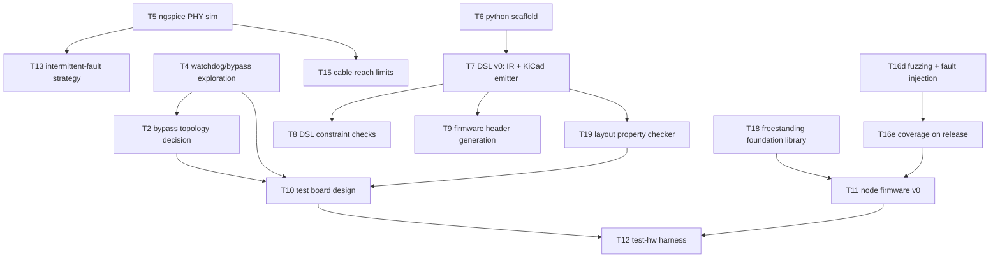

# KANBAN

The **single home for planned work** — the execution view over oparroy's
planning. Each card carries its own description; IDEAS.md is the
not-yet-ready stash, and DESIGN.md holds settled design decisions and
open design questions. When ordering matters, KANBAN wins.

Dormant in spirit until the project opens up, but cards are written in
final form from day one so pickup works the same then as now.

Each card is a **vertical slice** — thin end-to-end through the layers it
touches (DSL → firmware → board → test), completable as one change.
Cards that aren't slices (a DESIGN decision, research, a chore) carry a
**`Shape:`** tag so the picker knows.

## How to pick up work

1. Take the top card in **Next** that fits your context. Next is the set
   of cards with no unbuilt blockers; within Next, higher = higher
   leverage.
1. The change that ships a card **deletes the card** from this file —
   shipped cards are dropped, not moved into a Done column (git history
   is the durable archive). There is no In Progress column either.
1. On shipping, promote any newly-unblocked Backlog card into **Next**.

**If a card grows beyond one change, split it first** (T##a, T##b, …).
Never leave a card half-landed.

## Dependency graph

Critical paths only — every card also carries its own
`Blocked by:`/`Unblocks:`.

______________________________________________________________________

## Next

- **T16d — libFuzzer/AFL++ harnesses + fault-injection shims.** Fuzz
  the frame parser and ring state machine (alongside, not instead of,
  KLEE — fuzzing finds what the prover's assumptions miss, §8).
  Fault-injection shims make every failure path reachable in test:
  line errors, dropped/partial frames, timer glitches, watchdog
  timeouts, brown-outs (SQLite's every-boundary doctrine).
  **Blocked by:** — · **Unblocks:** T16e
- **T4 — Explore node watchdog/bypass circuits.** The two candidates in
  DESIGN.md §4 — normally-on analog switch held open by MCU-driven
  charge pump vs window-watchdog supervisor IC — each captured as a
  **standalone subcircuit file with ngspice simulation unit tests**
  (DESIGN.md §7: bypass-engage timing, single-missed-pulse tolerance,
  glitch immunity). Output: subcircuits + passing sim tests + a
  recommendation in DESIGN.md §4. **Blocked by:** — · **Unblocks:**
  T2, T10
- **T5 — ngspice simulation of the PHY.** Line drivers, comparator RX,
  bypass switches, connector-fault cases. Now concrete from T3
  (DESIGN.md §2): validate the no-analog-hysteresis baseline under
  noise/ringing, threshold tolerance, drive vs segment capacitance.
  **Blocked by:** — · **Unblocks:** T13, T15
- **T6 — Python package scaffold.** uv project, Python 3.13, ruff in
  strict rule selection, ty, pytest, `src/oparroy/` layout. No DSL code
  yet — just the harness it will grow in. *Shape: tooling.* **Blocked
  by:** — · **Unblocks:** T7
- **T18 — Freestanding foundation library.** AK-inspired (DESIGN.md
  §8): `ErrorOr<T>`, `TRY` propagation macro, fallible `try_*` APIs,
  fixed-capacity containers, ownership types over static arenas,
  `VERIFY` hook wired to the watchdog policy (§4). Host-compilable so
  T16's KLEE/fuzz harnesses exercise it from day one. **Blocked by:**
  — · **Unblocks:** T11

## Backlog

- **T2 — Choose bypass topology.** *Shape: decision.* Counter-rotating
  dual ring vs skip-one wires vs per-node switch only (IDEAS.md
  §Fault tolerance). Recorded in DESIGN.md §3. **Blocked by:** T4 ·
  **Unblocks:** T10
- **T7 — DSL v0: parts/nets IR + KiCad netlist emitter.** The home-rolled
  design-capture core (DESIGN.md §7). Includes subcircuit composition
  (functional circuits as their own files/units) and a parts DB with
  assembler-stock status per part. **Blocked by:** T6 · **Unblocks:**
  T8, T9
- **T8 — DSL constraint checking / property verification.** Electrical
  rules beyond KiCad ERC: bypass-path continuity under single-fault
  models, watchdog default-state assertions. **Blocked by:** T7 ·
  **Unblocks:** —
- **T19 — DSL layout property checker.** Parse `.kicad_pcb` and assert
  layout-level properties (DESIGN.md §7): bypass-path copper
  independence, LED-adjacent-to-connector placement contracts,
  net-class width/clearance compliance, trace-length budgets (feeds
  T15), mechanical contracts (min corner radius for handling,
  standoff mounting holes + keepouts, stackup contract — layer count
  and board thickness per §6/§9), board-level checklist
  conformance (power LED present, silkscreen board-ID fields —
  project/PCB name, author, date, version tied to git tag,
  handwritten serial-number box, CI-board protection subcircuit
  instantiated). Includes emitting net
  classes/keepouts into the
  `.kicad_pcb` so KiCad guides layout toward compliance pre-audit.
  **Blocked by:** T7 · **Unblocks:** T10
- **T9 — Firmware header generation from the DSL.** Pin maps and
  peripheral assignments emitted for the CH32V003 (DESIGN.md §5).
  **Blocked by:** T7 · **Unblocks:** T11
- **T10 — Test board design.** 8 ring nodes + supervisor, full fault
  injection (per-segment open/short, per-node power cut, clock kill),
  all scriptable (DESIGN.md §6). **Dual role — CI + demonstrator**
  (§6): a subset of nodes carries human-facing I/O (potentiometer,
  buttons, LEDs, buzzer), each input overridable from the supervisor
  (mux/DAC substitution, button paralleling) so scripted runs stay
  hands-off regardless of knob positions. Includes the
  **instrumented boundary node**: the supervisor-adjacent node's RX/TX
  ring segments (plus comparator-output and working-LED taps) wired to
  RP2040 GPIOs for PIO logic analysis and glitch stimulus (DESIGN.md
  §6). Captured in the DSL, layout in KiCad.
  Bela lesson (docs/bela-lessons-2026-09-26.md §5): the test rig is a
  first-class deliverable with its own schedule risk — budget for it,
  and test at the cheapest rework stage (post-SMT, pre-through-hole).
  **Blocked by:** T2, T4, T19 · **Unblocks:** T12
- **T16e — Coverage measured on the release build.** SQLite doctrine
  (§8): branch coverage of the freestanding *release* configuration —
  tests exercise what actually ships — wired as a script target in the
  flake shell. **Blocked by:** T16d · **Unblocks:** T11
- **T11 — Node firmware v0.** Receive-and-forward ring node on the
  CH32V003; the minimal slice that makes a multi-node ring pass bits.
  Per-bit cut-through forwarding with on-the-fly slot rewrite
  (DESIGN.md §2); bring up store-and-forward first for correctness,
  then switch to cut-through and measure timing closure. Gap-latched
  (vsync) output apply and input sampling per §2's global-shutter
  rule.
  Developed inside the verification harness (T16b–e) from the first
  commit. Trill pattern (docs/bela-lessons-2026-09-26.md §2): aim for
  **one firmware image, personality by node-type ID** — a single HIL
  target. **Blocked by:** T16e, T18 · **Unblocks:** T12
- **T12 — `test-hw` harness.** Local, scriptable test runs against the
  bench board: flash all nodes, inject faults, assert ring behavior.
  CI-platform integration is a later card. **Blocked by:** T10, T11 ·
  **Unblocks:** —
- **T13 — Intermittent-fault strategy.** *Shape: decision.* Protocol
  re-route vs hardware auto-bypass vs both (DESIGN.md §3). **Blocked
  by:** T5 · **Unblocks:** —
- **T15 — Characterize cable reach.** *Shape: research.* Maximum
  segment length unamplified, and with an amplifier/re-driver in the
  segment (DESIGN.md §9). ngspice over cable models first (RLGC of a
  candidate cable, capacitive load per node), then long-cable
  measurement on the test board. Output: numbers + amplifier guidance
  in DESIGN.md §2. **Blocked by:** T5 · **Unblocks:** —
