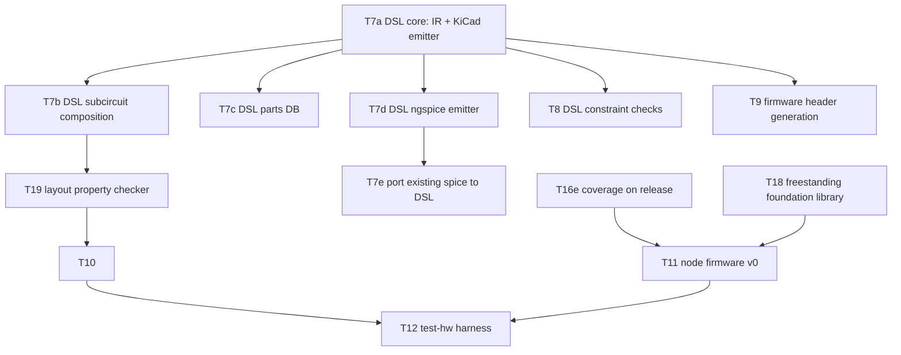

# KANBAN

The **single home for planned work** — the execution view over oparroy's
planning. Each card carries its own description; IDEAS.md is the
not-yet-ready stash, and DESIGN.md holds settled design decisions and
open design questions. When ordering matters, KANBAN wins.

Dormant in spirit until the project opens up, but cards are written in
final form from day one so pickup works the same then as now.

Each card is a **vertical slice** — thin end-to-end through the layers it
touches (DSL → firmware → board → test), completable as one change.
Cards that aren't slices (a DESIGN decision, research, a chore) carry a
**`Shape:`** tag so the picker knows.

## How to pick up work

1. Take the top card in **Next** that fits your context. Next is the set
   of cards with no unbuilt blockers; within Next, higher = higher
   leverage.
1. The change that ships a card **deletes the card** from this file —
   shipped cards are dropped, not moved into a Done column (git history
   is the durable archive). There is no In Progress column either.
1. On shipping, promote any newly-unblocked Backlog card into **Next**.

**If a card grows beyond one change, split it first** (T##a, T##b, …).
Never leave a card half-landed.

## Dependency graph

Critical paths only — every card also carries its own
`Blocked by:`/`Unblocks:`.

______________________________________________________________________

## Next

- **T7a — DSL core: parts/nets IR + KiCad netlist emitter.** The
  design-capture spine (DESIGN.md §7): a separable, pretty-printable IR
  behind a plain function-call capture API (HDL-instantiation flavor;
  sugar deferred), emitting the netlist pcbnew ingests — symbol/
  footprint references validated against KiCad's libraries, provisioned
  via the flake. Flat capture only — hierarchy is T7b, the parts DB is
  T7c; parts are declared ad hoc. Captures live in a new `design/`
  tree. Proven by re-capturing `circuits/watchdog-chargepump/` flat and
  golden-testing the emitted netlist; emission is byte-identical across
  runs (§8 reproducibility). Includes a Graphviz dot dump as the
  minimal human-review view. **Blocked by:** — · **Unblocks:** T7b,
  T7c, T7d, T8, T9
- **T18 — Freestanding foundation library.** AK-inspired (DESIGN.md
  §8): `ErrorOr<T>`, `TRY` propagation macro, fallible `try_*` APIs,
  fixed-capacity containers, ownership types over static arenas,
  `VERIFY` hook wired to the watchdog policy (§4). 2026-09-26: `Span`,
  `irange`, `StaticVector`, and the `VERIFY` macro itself landed in
  `firmware/lib/`; what remains is `ErrorOr`/`TRY`, arenas, and wiring
  VERIFY's target failure hook to §4. Host-compilable so
  T16's KLEE/fuzz harnesses exercise it from day one. **Blocked by:**
  — · **Unblocks:** T11
- **T16e — Coverage measured on the release build.** SQLite doctrine
  (§8): branch coverage of the freestanding *release* configuration —
  tests exercise what actually ships — wired as a script target in the
  flake shell. **Blocked by:** — · **Unblocks:** T11
- **T13 — Intermittent-fault strategy.** *Shape: decision.* Protocol
  re-route vs hardware auto-bypass vs both (DESIGN.md §3). T5's
  detection hooks: supervisor frame-echo comparison, illegal-cell
  detection, and the pull-down-parked idle-low segment (§2 measured
  block). **Blocked by:** — · **Unblocks:** —
- **T15 — Characterize cable reach.** *Shape: research.* Maximum
  segment length unamplified, and with an amplifier/re-driver in the
  segment (DESIGN.md §9). ngspice over cable models first (RLGC of a
  candidate cable, capacitive load per node) — build on
  `circuits/phy-segment/` (swap the lumped segment for the RLGC line;
  T5's lumped-C baseline is benign: margins flat to 1 nF, but keep
  far-end edge rates within what tb_noise covered or rerun it) — then
  long-cable measurement on the test board. Output: numbers +
  amplifier guidance in DESIGN.md §2. **Blocked by:** — ·
  **Unblocks:** —
- **T21 — Prior-art review: automatic schematic generation.** *Shape:
  research.* Survey how existing tools turn netlists into readable
  schematics — netlistsvg, yosys `show`, SKiDL's schematic generation,
  KiCad's netlist-import placement, commercial ESL auto-drawing — and
  the graph-drawing literature underneath (layered/Sugiyama layout,
  orthogonal routing). The goal is abstraction-level block views for
  design review (DESIGN.md §7 DSL shape): decide what oparroy's views
  should look like beyond T7a's dot dump, and what we build vs borrow.
  Output: findings in `docs/`. **Blocked by:** — · **Unblocks:** —

## Backlog

- **T7b — DSL subcircuit composition.** Functional circuits as instanced
  units with declared port interfaces (§7): hierarchy carried into
  refdes/net naming, refdes stability across source edits, multi-instance
  capture — the test board's 8 identical node circuits as the proving
  case. **Blocked by:** T7a · **Unblocks:** T19
- **T7c — DSL parts DB with assembler-stock status.** One record per
  part: LCSC number, JLCPCB Basic/Extended tier, stock count with as-of
  date, KiCad symbol/footprint pair, spice model binding, datasheet
  pointer into `datasheets/`. A freshness check flags stale stock
  entries (§6: part selection is inventory-driven); feeds T8's
  unsourcable-part check. The emitter resolves parts from the DB,
  replacing T7a's ad-hoc declarations. **Blocked by:** T7a ·
  **Unblocks:** —
- **T7d — DSL ngspice emitter.** Simulation-netlist backend over the
  T7a IR: emits the DUT netlist (`.subckt` wrappers matching the
  hand-written interfaces in `circuits/`), with spice model bindings
  declared ad hoc until T7c's parts DB owns them. Boundary: stimulus
  and `.meas` assertions stay in external bench decks — the DSL emits
  the circuit, benches drive it — so today's benches run unmodified
  against either capture. **Blocked by:** T7a · **Unblocks:** T7e
- **T7e — Port existing spice captures to the DSL.** Re-capture the DUT
  netlists of `circuits/phy-segment/`, `circuits/watchdog-chargepump/`,
  and `circuits/watchdog-supervisor/` in the DSL, with equivalence
  tests: the existing benches run against the DSL-emitted netlists and
  reproduce the measured numbers recorded in DESIGN.md §2/§4. Device
  models (`circuits/lib/*.spi`) stay hand-written includes. On
  shipping, the hand-written DUT `.cir` files retire — the DSL becomes
  the single source of truth (§7), not a second copy of it.
  **Blocked by:** T7d · **Unblocks:** —
- **T8 — DSL constraint checking / property verification.** Electrical
  rules beyond KiCad ERC: bypass-path continuity under single-fault
  models, watchdog default-state assertions. **Blocked by:** T7a ·
  **Unblocks:** —
- **T19 — DSL layout property checker.** Parse `.kicad_pcb` and assert
  layout-level properties (DESIGN.md §7): bypass-path copper
  independence, LED-adjacent-to-connector placement contracts,
  net-class width/clearance compliance, trace-length budgets (feeds
  T15), mechanical contracts (min corner radius for handling,
  standoff mounting holes + keepouts, stackup contract — layer count
  and board thickness per §6/§9), board-level checklist
  conformance (power LED present, silkscreen board-ID fields —
  project/PCB name, author, date, version tied to git tag,
  handwritten serial-number box, CI-board protection subcircuit
  instantiated). Includes emitting net
  classes/keepouts into the
  `.kicad_pcb` so KiCad guides layout toward compliance pre-audit.
  **Blocked by:** T7b · **Unblocks:** T10
- **T9 — Firmware header generation from the DSL.** Pin maps and
  peripheral assignments emitted for the CH32V003 (DESIGN.md §5).
  **Blocked by:** T7a · **Unblocks:** T11
- **T10 — Test board design.** 8 ring nodes + supervisor, full fault
  injection (per-segment open/short, per-node power cut, clock kill),
  all scriptable (DESIGN.md §6). **Dual role — CI + demonstrator**
  (§6): a subset of nodes carries human-facing I/O (potentiometer,
  buttons, LEDs, buzzer), each input overridable from the supervisor
  (mux/DAC substitution, button paralleling) so scripted runs stay
  hands-off regardless of knob positions. Includes the
  **instrumented boundary node**: the supervisor-adjacent node's RX/TX
  ring segments (plus comparator-output and working-LED taps) wired to
  RP2040 GPIOs for PIO logic analysis and glitch stimulus (DESIGN.md
  §6). Captured in the DSL, layout in KiCad.
  Bela lesson (docs/bela-lessons-2026-09-26.md §5): the test rig is a
  first-class deliverable with its own schedule risk — budget for it,
  and test at the cheapest rework stage (post-SMT, pre-through-hole).
  **Blocked by:** T19 · **Unblocks:** T12
- **T11 — Node firmware v0.** Receive-and-forward ring node on the
  CH32V003; the minimal slice that makes a multi-node ring pass bits.
  Per-bit cut-through forwarding with on-the-fly slot rewrite
  (DESIGN.md §2); bring up store-and-forward first for correctness,
  then switch to cut-through and measure timing closure. Gap-latched
  (vsync) output apply and input sampling per §2's global-shutter
  rule.
  Developed inside the verification harness (T16b–e) from the first
  commit. Trill pattern (docs/bela-lessons-2026-09-26.md §2): aim for
  **one firmware image, personality by node-type ID** — a single HIL
  target. **Blocked by:** T16e, T18 · **Unblocks:** T12
- **T12 — `test-hw` harness.** Local, scriptable test runs against the
  bench board: flash all nodes, inject faults, assert ring behavior.
  CI-platform integration is a later card. **Blocked by:** T10, T11 ·
  **Unblocks:** —
