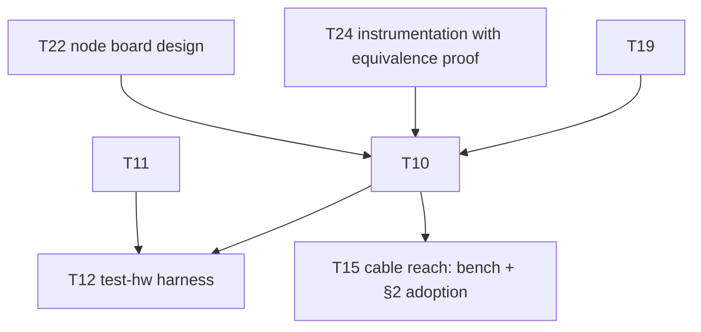

# KANBAN

The **single home for planned work** — the execution view over oparroy's
planning. Each card carries its own description; IDEAS.md is the
not-yet-ready stash, and DESIGN.md holds settled design decisions and
open design questions. When ordering matters, KANBAN wins.

Dormant in spirit until the project opens up, but cards are written in
final form from day one so pickup works the same then as now.

Each card is a **vertical slice** — thin end-to-end through the layers it
touches (DSL → firmware → board → test), completable as one change.
Cards that aren't slices (a DESIGN decision, research, a chore) carry a
**`Shape:`** tag so the picker knows.

## How to pick up work

1. Take the top card in **Next** that fits your context. Next is the set
   of cards with no unbuilt blockers; within Next, higher = higher
   leverage.
1. The change that ships a card **deletes the card** from this file —
   shipped cards are dropped, not moved into a Done column (git history
   is the durable archive). There is no In Progress column either.
1. On shipping, promote any newly-unblocked Backlog card into **Next**.

**If a card grows beyond one change, split it first** (T##a, T##b, …).
Never leave a card half-landed.

## Dependency graph

Critical paths only — every card also carries its own
`Blocked by:`/`Unblocks:`.

______________________________________________________________________

## Next

- **T24 — DSL instrumentation transforms with reset-state equivalence.**
  The CI board is the node design plus injected controllability and
  observability (§6: fault-injection muxes, supervisor-override muxes,
  sense taps) — and that makes it *dangerously different* from the
  plain node it is meant to exercise (raised 2026-09-27). Capture
  instrumentation as an **explicit transformation** of the
  uninstrumented design — insert a series switch on this net, hang a
  sense tap off that one — never a hand-maintained second capture, so
  the two can never drift. The checker then proves the instrumented
  board **in reset state** is equivalent to the plain board: every
  inserted series element in its default/pass-through state reduces to
  a wire (net merge), every tap is high-impedance, no base part or net
  is lost, and residual differences (the series element's on-resistance
  in the §2 decode-margin budget, tap capacitance on the §6 short-stub
  contract) are enumerated and budgeted, not assumed away. "Almost
  equivalent" is exactly the set of those enumerated residuals.
  **Blocked by:** — · **Unblocks:** T10
- **T22 — Node board design.** The single ring node as its own small
  board, designed **before** the CI board — the CI board is eight of
  these tiles plus a supervisor (DESIGN.md §6). The DSL capture landed
  2026-09-28: CH32V003 + PHY front-end (§2), charge-pump watchdog (§4),
  status LEDs (§4.1), terminal protection (§7 checklist), two segment
  connectors (§3 pinout — the T7bb `design/segment.py` block), plus the
  footprint-assignment and annotation/back-annotation stages (§7).
  Remaining: lay out the board in KiCad — the first real pcbnew netlist
  ingest (the T7a caveat, §7) — validate the back-annotation join
  against the real `.kicad_pcb` (so far tested against synthetic input
  only), fab via JLCPCB (§6), and settle the node-board stackup
  question (§9) at quote time.
  **Blocked by:** — · **Unblocks:** T10
- **T7e — Port existing spice captures to the DSL.** Re-capture the DUT
  netlists of `circuits/phy-segment/` and
  `circuits/watchdog-supervisor/` in the DSL — the charge pump's
  capture landed with T7d (2026-09-28) and its three benches already
  run unmodified against the DSL emission — with equivalence tests:
  the existing benches run against the DSL-emitted netlists and
  reproduce the measured numbers recorded in DESIGN.md §2/§4. Needs
  spice bindings beyond T7d's R/C/BAT54S set: external-subckt
  instantiations (`ch32v003_tx_pin`, `sn74lvc1g3157`), `.include` of
  `circuits/lib/*.spi`, subckt `params:`. Device models stay
  hand-written includes. On shipping, the hand-written DUT `.cir`
  files retire — the DSL becomes the single source of truth (§7), not
  a second copy of it. **Blocked by:** — · **Unblocks:** —
- **T23 — DSL parametric value resolution.** Computed component values
  carry slack (DESIGN.md §7): the capture states a spec — target plus
  tolerance — and the emitter resolves it to real parts from the parts
  DB's stocked bins: the VDD/2 divider comes out of the 10k bin, never
  an irrational computed number. Includes ratio specs (a divider ratio
  met by any pair from a bin) and reporting the achieved error of the
  chosen values against the spec. Widens `Part.value` from `str` to a
  value-spec type (DESIGN.md §7). Generalizes to **ranges as the
  universal value spec** and **generators** (PolymorphicBlocks steal,
  2026-09-27): a solve pass between capture and check (capture → solve
  → check → emit) where a subcircuit computes its own part values from
  context — the LED sizes its resistor from the actual rail voltage.
  Solving stays a pass over the finished IR, never tangled into
  construction: plain-Python capture semantics hold (PB's `IntLike`
  interleaving is the anti-pattern). **Blocked by:** — ·
  **Unblocks:** —
- **T25 — Project-owned unit-test harness.** AK LibTest-style (raised
  in PR #17 review, 2026-09-28): `TEST_CASE`/`EXPECT` macros over a
  tiny report hook — failure index as exit code freestanding,
  `write(2)` + manual itoa on host, so no hosted header enters the
  tree (code-std.md §2) and tests keep compiling against the shipped
  freestanding configuration (T16e's test-what-ships doctrine).
  Packaged frameworks fail that bar: gtest/Catch2/doctest need
  exceptions, RTTI, or a hosted runtime, and a per-target flag fork
  for tests is exactly the test-build-vs-shipped-build split the
  doctrine rejects; snitch is the packaged fallback if the harness
  outgrows maintenance-in-house. First consumer: port
  `firmware/lib/test_foundation.cpp`'s hand-rolled exit-code checks
  into named cases that read as usage examples — §12's
  examples-first doctrine, C++ side. The report hook takes the same
  wiring-point shape as `lib::verify_failed`: target-side reporting
  over the debug transport lands with T11/T12. **Blocked by:** — ·
  **Unblocks:** —

## Backlog

- **T7bd — DSL connection sugar.** Split out of T7b (2026-09-28); added
  only as the flat style proves tedious: `chain()` over
  `Input`/`Output`/`InOut`-tagged ports (the ring *is* a chain; `InOut`
  is the tapped RX-in-bypass semantics, §4) — requires port direction
  tags on T7ba's ports — named connections naming nets, a
  lexically-scoped `with`-block for implicit power/ground (scope stays
  explicit — the no-implicit-global-circuit rule holds). **Blocked
  by:** — · **Unblocks:** T26
- **T26 — DSL review views: block + detail.** *Shape:
  implementation.* Follow-up of T21
  (docs/prior-art-schematic-gen-2026-09-28.md — borrow the layout
  engine, build only the view extraction, never build a
  placement/routing engine). **Block view first**: one box per
  subcircuit instance (`Part.path` carries the metadata), ports / port
  arrays / bundles as box pins, bundles as single thick wires; then
  the **detail view** — one subcircuit's parts and nets, direction
  hints from KiCad `PinType`, `power:`-symbol nets collapsed to named
  stubs, series passives optionally collapsed into labeled wire
  segments. Layout engine: **grandalf** first (EPL-1.0 — depend
  unmodified via uv, never vendored into this MIT tree; its shipped
  routers are straight/spline only, so orthogonal routing is patched
  in), ELK/elkjs the quality fallback with native port / hyperedge /
  orthogonal support. Symbol graphics from KiCad library geometry —
  extend `kicadlib.py` to read drawing primitives (SKiDL's
  `generate_svg()` symbol→netlistsvg-skin conversion is the prior
  art); generic boxes with pin names suffice until then. Output static
  SVG, golden-tested like the netlist emitter's byte-identical
  goldens; not `.kicad_sch` — editable output is SKiDL's trap and buys
  review nothing. T7bd's port direction tags are the block view's
  natural input. **Blocked by:** T7bd · **Unblocks:** —
- **T19 — DSL layout property checker, remaining checks.** First slice
  landed 2026-09-28: `.kicad_pcb` parser, the `LayoutRules` contract
  with the first check set (stackup, net-class width/via, trace
  budgets, corner radius, silkscreen ID fields, serial-box area,
  mounting holes + keepouts, adjacency/presence, bypass pad
  whitelisting), and the constraint-skeleton emitter (DESIGN.md §7).
  Remaining, each wanting the first real board (T22) to calibrate
  against: **copper-geometry bypass independence** beyond pad
  whitelisting (bypass-net segments/vias must not touch node-logic
  copper between RX and TX, §4 — includes parsing copper arc tracks,
  which the parser skips today); **serial-box clearance** from pads
  and other silkscreen text (needs board-absolute pad positions —
  footprint rotation is not yet modeled); **TVS/series-R placement
  contracts** (§7 checklist: TVS adjacent to its connector, R between
  TVS and µC pin — needs the T22 capture to name the parts);
  **channelization hook** (per-instance layout replication keyed on
  T7ba sheetpath metadata, meaningless until a hierarchical board
  exists); **pcbnew ingest validation** of the emitted skeleton (real
  KiCad round trip — T22 exercises the first one).
  **Blocked by:** T22 · **Unblocks:** T10
- **T10 — Test board design.** 8 ring nodes + supervisor, full fault
  injection (per-segment open/short, per-node power cut, clock kill),
  all scriptable (DESIGN.md §6). **Dual role — CI + demonstrator**
  (§6): a subset of nodes carries human-facing I/O (potentiometer,
  buttons, LEDs, buzzer), each input overridable from the supervisor
  (mux/DAC substitution, button paralleling) so scripted runs stay
  hands-off regardless of knob positions. Includes the
  **instrumented boundary node**: the supervisor-adjacent node's RX/TX
  ring segments (plus comparator-output and working-LED taps) wired to
  RP2040 GPIOs for PIO logic analysis and glitch stimulus (DESIGN.md
  §6). Nodes tile the T22 node-board design; captured in the DSL,
  layout in KiCad.
  Bela lesson (docs/bela-lessons-2026-09-26.md §5): the test rig is a
  first-class deliverable with its own schedule risk — budget for it,
  and test at the cheapest rework stage (post-SMT, pre-through-hole).
  **Blocked by:** T19, T22, T24 · **Unblocks:** T12, T15
- **T11 — Node firmware v0.** Receive-and-forward ring node on the
  CH32V003; the minimal slice that makes a multi-node ring pass bits.
  Per-bit cut-through forwarding with on-the-fly slot rewrite
  (DESIGN.md §2); bring up store-and-forward first for correctness,
  then switch to cut-through and measure timing closure. Gap-latched
  (vsync) output apply and input sampling per §2's global-shutter
  rule.
  Developed inside the verification harness (T16b–e) from the first
  commit. First consumer of the T9 pin map: wire
  `firmware/node/pins.hpp` regeneration into meson as a
  `custom_target()` (a documented manual step since 2026-09-28 —
  `python -m design.node_pins > firmware/node/pins.hpp`, drift caught
  by the golden + firmware-copy tests). Trill pattern
  (docs/bela-lessons-2026-09-26.md §2): aim for
  **one firmware image, personality by node-type ID** — a single HIL
  target. Defines `lib::verify_failed`, the §4 VERIFY failure hook
  whose wiring point T18 landed (2026-09-28): report over the debug
  transport, then stop the keep-alive strobe so the charge-pump
  watchdog engages RX→TX bypass. **Blocked by:** — ·
  **Unblocks:** T12, T13
- **T12 — `test-hw` harness.** Local, scriptable test runs against the
  bench board: flash all nodes, inject faults, assert ring behavior.
  CI-platform integration is a later card. **Blocked by:** T10, T11 ·
  **Unblocks:** —
- **T8 — DSL constraint checking: board-level property checks.**
  Partially shipped 2026-09-28: range-carrying typed ports, the per-net
  interval-containment check, and waivers-as-data are landed
  (DESIGN.md §7). Remaining: **bypass-path continuity under
  single-fault models** and **watchdog default-state assertions** —
  both inspect board-level topology (the bypass switch, the
  supervisor) that only the T22 node-board capture provides. Also
  **pin/part-level ranges**: a regulator's output range, an MCU pin's
  input range — declarations fed by the T7c parts DB, extending ranges
  beyond scalar ports (port arrays, bundles). **Blocked by:** T22 ·
  **Unblocks:** —
- **T15 — Cable reach: bench confirmation and §2 adoption.** *Shape:
  research.* Sim half landed 2026-09-28
  (`docs/cable-reach-2026-09-28.md`): 10 m per segment on 3M 3365
  ribbon with the §7 470 Ω protection, the 470 Ω TX series R (not the
  cable) sets the limit, analog re-slice repeaters *reduce* reach,
  power (not signal) binds under a connector break. Remaining:
  long-cable bench measurement on the test board — 3365/06 reels at
  5/10/15/25 m, per-segment error counting under the §6
  fault-injection harness, far-end overshoot vs real TVS clamps on
  the instrumented boundary node's PIO taps — plus comparator offset
  on real silicon at staircase edge rates (sim swept the ±13 mV
  fast-edge spec). On shipping: adopt the doc's proposed DESIGN.md §2
  block, resolve the §9 cable-reach open question, and decide the
  broken-loop power policy (≤ 5 m segments vs §2.1 second-tap
  injection). **Blocked by:** T10 · **Unblocks:** —
- **T13 — Intermittent-fault strategy.** *Shape: decision.* Protocol
  re-route vs hardware auto-bypass vs both (DESIGN.md §3, §9).
  **Postponed 2026-09-28:** the decision is unratifiable before the
  substrate it polices exists — no frame format, no firmware
  prototype, no node schematic. PR #6's analysis
  (`docs/intermittent-fault-strategy-2026-09-28.md`, on the retained
  branch `t13-intermittent-fault-strategy`; PR closed unmerged) is
  the starting point on pickup: it recommends a layered split —
  protocol re-route with anti-flap hysteresis for segment faults, the
  §4 charge-pump bypass for MCU death, deliberate self-bypass as the
  escalation rung, no new hardware. Open questions recorded in PR
  #6's closing discussion, to be answered before ratification:
  hysteresis observability under one-direction RX source select,
  flap-latch semantics on subsequent faults, flap contagion between
  adjacent nodes, escalation-command delivery over the flapping
  fabric, and ring-level convergence as a proof obligation. Direction
  to design for in T11: **protocol-level keepalive** — a healthy line
  is never silent longer than ~1 s — so silence is an unambiguous
  fault signal and flip policy keys on edge presence, not decode
  quality. T5's detection hooks: supervisor frame-echo comparison,
  illegal-cell detection, and the pull-down-parked idle-low segment
  (§2 measured block). **Blocked by:** T11 · **Unblocks:** —
