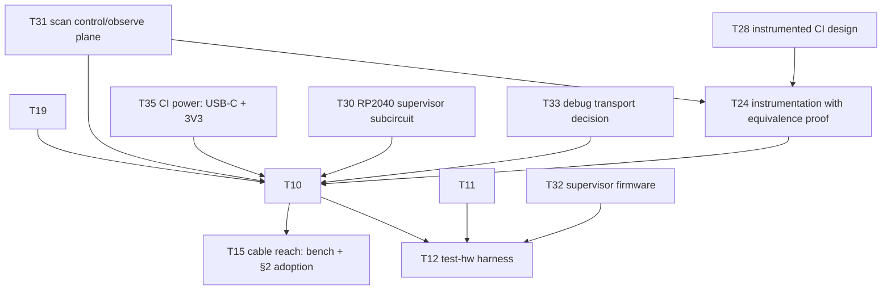

# KANBAN

The **single home for planned work** — the execution view over oparroy's
planning. Each card carries its own description; IDEAS.md is the
not-yet-ready stash, and DESIGN.md holds settled design decisions and
open design questions. When ordering matters, KANBAN wins.

Dormant in spirit until the project opens up, but cards are written in
final form from day one so pickup works the same then as now.

Each card is a **vertical slice** — thin end-to-end through the layers it
touches (DSL → firmware → board → test), completable as one change.
Cards that aren't slices (a DESIGN decision, research, a chore) carry a
**`Shape:`** tag so the picker knows.

## How to pick up work

1. Take the top card in **Next** that fits your context. Next is the set
   of cards with no unbuilt blockers; within Next, higher = higher
   leverage.
1. The change that ships a card **deletes the card** from this file —
   shipped cards are dropped, not moved into a Done column (git history
   is the durable archive). There is no In Progress column either.
1. On shipping, promote any newly-unblocked Backlog card into **Next**.

**If a card grows beyond one change, split it first** (T##a, T##b, …).
Never leave a card half-landed.

## Dependency graph

Critical paths only — every card also carries its own
`Blocked by:`/`Unblocks:`.

______________________________________________________________________

## Next

- **T28 — Instrumented CI design.** *Shape: design.* Settles the
  instrumented half that today exists only as §6 prose (raised
  2026-09-29: T24 has no instrumented design to transform, and the
  T24 ↔ T10 dependency was circular without this card). From §6 to a
  settled design: the fault-injection complement (per-segment
  open/short, per-node power cut, clock kill) with fault-switch part
  selection, the supervisor-override design for human I/O (pot-wiper
  mux, button parallel), and the boundary node's tap set — the
  shift-register control plane's wiring and power-on reset levels
  split out 2026-09-30 into T31 (unblocked; the bit inventory
  finalizes against this card's fault complement).
  Expressed as the **transform list** against the settled node board
  design (`boards/node/`) — the artifact T24's machinery encodes and
  T10's capture consumes. Promoted to Next 2026-10-05: the node board
  design it transforms against has landed.
  **Blocked by:** — · **Unblocks:** T24, T10
- **T19 — DSL layout property checker, remaining checks.** First slice
  landed 2026-09-28: `.kicad_pcb` parser, the `LayoutRules` contract
  with the first check set (stackup, net-class width/via, trace
  budgets, corner radius, silkscreen ID fields, serial-box area,
  mounting holes + keepouts, adjacency/presence, bypass pad
  whitelisting), and the constraint-skeleton emitter (DESIGN.md §7).
  Remaining, each calibrated against the node board (`boards/node/`):
  **copper-geometry bypass independence** beyond pad
  whitelisting (bypass-net segments/vias must not touch node-logic
  copper between RX and TX, §4 — includes parsing copper arc tracks,
  which the parser skips today); **serial-box clearance** from pads
  and other silkscreen text (needs board-absolute pad positions —
  footprint rotation is not yet modeled); **TVS/series-R placement
  contracts** (§7 checklist: TVS adjacent to its connector, R between
  TVS and µC pin — needs the node capture (`design/node.py`) to name
  the parts); **footprint-set equality** (the B.Cu footprint set is
  exactly the segment connectors) and **part-over-hole** (each
  reverse-mount status LED over its routed hole) — the §7 contracts
  added 2026-09-29; **channelization hook** (per-instance layout
  replication keyed on T7ba sheetpath metadata, meaningless until a
  hierarchical board exists); **pcbnew ingest validation** of the
  emitted skeleton (real KiCad round trip — the node board was the
  first, 2026-10-04). Promoted to Next 2026-10-05: the calibration
  board exists.
  **Blocked by:** — · **Unblocks:** T10
- **T25 — Project-owned unit-test harness.** AK LibTest-style (raised
  in PR #17 review, 2026-09-28): `TEST_CASE`/`EXPECT` macros over a
  tiny report hook — failure index as exit code freestanding,
  `write(2)` + manual itoa on host, so no hosted header enters the
  tree (code-std.md §2) and tests keep compiling against the shipped
  freestanding configuration (T16e's test-what-ships doctrine).
  Packaged frameworks fail that bar: gtest/Catch2/doctest need
  exceptions, RTTI, or a hosted runtime, and a per-target flag fork
  for tests is exactly the test-build-vs-shipped-build split the
  doctrine rejects; snitch is the packaged fallback if the harness
  outgrows maintenance-in-house. First consumer: port
  `firmware/lib/test_foundation.cpp`'s hand-rolled exit-code checks
  into named cases that read as usage examples — §12's
  examples-first doctrine, C++ side. The report hook takes the same
  wiring-point shape as `lib::verify_failed`: target-side reporting
  over the debug transport lands with T11/T12. Lands before T11 so
  firmware v0 is written as named cases from day one, not ported later
  (2026-10-04 ordering decision). **Blocked by:** — ·
  **Unblocks:** —
- **T11 — Node firmware v0.** Receive-and-forward ring node on the
  CH32V003; the minimal slice that makes a multi-node ring pass bits.
  Per-bit cut-through forwarding with on-the-fly slot rewrite
  (DESIGN.md §2); bring up store-and-forward first for correctness,
  then switch to cut-through and measure timing closure. Gap-latched
  (vsync) output apply and input sampling per §2's global-shutter
  rule.
  Developed inside the verification harness (T16b–e) from the first
  commit — no hardware needed, so it runs in parallel with the board
  track (promoted to Next 2026-10-04). First consumer of the T9 pin
  map: wire `firmware/node/pins.hpp` regeneration into meson as a
  `custom_target()` (a documented manual step since 2026-09-28 —
  `python -m design.node_pins > firmware/node/pins.hpp`, drift caught
  by the golden + firmware-copy tests). Trill pattern
  (docs/bela-lessons-2026-09-26.md §2): aim for
  **one firmware image, personality by node-type ID** — a single HIL
  target. Defines `lib::verify_failed`, the §4 VERIFY failure hook
  whose wiring point T18 landed (2026-09-28): report over the debug
  transport, then stop the keep-alive strobe so the charge-pump
  watchdog engages RX→TX bypass. Programmer tooling (minichlink-class)
  joins the flake alongside the firmware (§6, 2026-09-29).
  **Blocked by:** — ·
  **Unblocks:** T12, T13
- **T31 — CI scan control/observe plane.** *Shape: design.* Split out
  of T28 (2026-09-30). Settles the §6 (2026-09-29) shift-register
  plane as its own design: 74HC595-class control stages and
  74HC165-class observe stages in one daisy chain under a global
  latch/capture clock; chain partitioning (per-tile slices vs
  functional grouping, control/observe interleave); the bit inventory
  by function — mux selects, per-node power switches, fault-injection
  switches, human-I/O overrides, the boundary node's watchdog-defeat
  bit (§6); and **power-on reset levels** — every control bit's POR
  state must reduce the instrumented board to the plain board, and
  these levels are what T24's reset-state equivalence proof derives
  from. Also the analog-mux hierarchy the chain drives: the
  fault-injection muxes (per T28's complement), the SWIO flash mux
  (§6, 2026-09-29), and the pot-wiper override muxes (§6 dual role).
  The architecture stands alone — 595/165 classes, chain topology,
  POR-level philosophy need nothing from the node design; the bit
  inventory finalizes with T28's fault complement. **Blocked by:** — ·
  **Unblocks:** T24, T10
- **T35 — CI board power: USB-C inlet and 3.3 V rail.** DSL capture of
  the board's power tree (§6, 2026-09-30): one USB-C receptacle is
  both power inlet and host link — CC sink pull-downs (5.1 kΩ Rd ×2,
  no PD, 5 V only), 5 V distribution, and a **3.3 V regulator**
  feeding the ring rail (§2.1) and all board logic: 8 tiles through
  the per-node power-cut switches (T28's fault complement slots in
  downstream of the rail), RP2040, and the scan plane. Power budget
  against baseline USB-C 5 V delivery: tiles at tens of mA each
  (§2.1), RP2040, fault/scan logic. Regulator and connector are
  inventory-driven picks into the parts DB (§6, §7). Decides whether
  the §2.1 unregulated payload rail is populated (plain 5 V copper) or
  omitted on this board. **Blocked by:** — · **Unblocks:** T10
- **T30 — RP2040 supervisor subcircuit.** DSL capture of the §5
  supervisor: RP2040 minimal system — QSPI flash, 12 MHz crystal (§5:
  the supervisor keeps its crystal for USB), decoupling, boot/reset —
  with D+/D− from the board's single USB-C receptacle (shared with
  power, §6 2026-09-30). Carries the GPIO/PIO budget: the SWIO flash
  channel and its mux select (§6, 2026-09-29), the boundary node's
  four taps (RX, TX, comparator-out, working-LED — §6), scan-chain
  clock/data/latch (T31), and whatever the debug-transport decision
  (§9) adds — capture proceeds with those pins reserved, the budget
  finalizes with the decision. Pin-scarcity-checked like the T9 node
  pin map; at 30 GPIO the IDEAS scarcity lint starts to apply.
  **Blocked by:** — · **Unblocks:** T10
- **T33 — Debug transport decision.** *Shape: decision.* Settles the
  §6/§9 open question — per-node UART vs shared bus vs
  scan-observe-only — for runtime debug output from the eight nodes:
  bandwidth need (assert reports; the §4 `lib::verify_failed` wiring
  point reports over this transport), RP2040 pin/PIO cost (feeds the
  T30 budget), connector or pogo style, and interaction with the SWIO
  flash mux (does debug ride the same mux?). Recorded into DESIGN.md
  §6 on resolution. **Blocked by:** — · **Unblocks:** T10
- **T34 — CI board block diagram.** *Shape: docs.* One page showing
  the whole CI board as blocks and the wires between them: the USB-C
  inlet → 5 V → 3.3 V regulator power tree (T35), the RP2040
  supervisor and its PIO roles (T30), the scan control/observe chain
  and the mux hierarchy it drives (T31), the eight node tiles with
  their fault-injection complement (T28), the instrumented boundary
  node's tap set (§6), and the human-I/O override paths (§6 dual
  role). Mermaid in `docs/` so it diffs and reviews like the rest of
  the planning docs. Drawn from §6 prose as a first pass — it is the
  review artifact for the T28/T31/T10 conversations — revised as those
  settle, and retired in favor of T26's generated block view once the
  T10 capture exists. **Blocked by:** — · **Unblocks:** —
- **T7e — Port existing spice captures to the DSL.** Re-capture the DUT
  netlists of `circuits/phy-segment/` and
  `circuits/watchdog-supervisor/` in the DSL — the charge pump's
  capture landed with T7d (2026-09-28) and its three benches already
  run unmodified against the DSL emission — with equivalence tests:
  the existing benches run against the DSL-emitted netlists and
  reproduce the measured numbers recorded in DESIGN.md §2/§4. Needs
  spice bindings beyond T7d's R/C/BAT54S set: external-subckt
  instantiations (`ch32v003_tx_pin`, `sn74lvc1g3157`), `.include` of
  `circuits/lib/*.spi`, subckt `params:`. Device models stay
  hand-written includes. On shipping, the hand-written DUT `.cir`
  files retire — the DSL becomes the single source of truth (§7), not
  a second copy of it. Lands before T24/T10 generate new captures, so
  the equivalence pattern is settled before it multiplies (2026-10-04
  ordering decision). **Blocked by:** — · **Unblocks:** —
- **T23 — DSL parametric value resolution.** Computed component values
  carry slack (DESIGN.md §7): the capture states a spec — target plus
  tolerance — and the emitter resolves it to real parts from the parts
  DB's stocked bins: the VDD/2 divider comes out of the 10k bin, never
  an irrational computed number. Includes ratio specs (a divider ratio
  met by any pair from a bin) and reporting the achieved error of the
  chosen values against the spec. Widens `Part.value` from `str` to a
  value-spec type (DESIGN.md §7). Generalizes to **ranges as the
  universal value spec** and **generators** (PolymorphicBlocks steal,
  2026-09-27): a solve pass between capture and check (capture → solve
  → check → emit) where a subcircuit computes its own part values from
  context — the LED sizes its resistor from the actual rail voltage.
  Solving stays a pass over the finished IR, never tangled into
  construction: plain-Python capture semantics hold (PB's `IntLike`
  interleaving is the anti-pattern). **Blocked by:** — ·
  **Unblocks:** —
- **T22b — Node board fab.** *Shape: chore — needs a human.* Split
  from T22 (2026-10-04): everything past the settled design. BAT54S
  verified 2026-10-04: KEXIN C369929, Extended tier, 1,181 in stock at
  $0.0158 @1 — the parts DB now binds it (`design/parts_db.py`); the
  never-queried TWGMC C727126 listing is dropped. Remaining: re-check
  C22385222 header stock before ordering (buy-ahead deferred
  2026-09-29); the node board's silkscreen nudges and JLCPCB's
  NPTH-to-copper capability check at quote time (fab-prep leftovers
  inherited from the node-board design, settled 2026-10-05 — the
  board's remaining small DRC warnings stay deliberately unfixed
  until then), then fab via JLCPCB (§6): assemble 2, the minimum;
  blanks hand-solderable. Fabs **second**, after the T10 CI board
  (2026-09-30 decision): the CI board's eight tiles are the first
  bench articles. **Blocked by:** — · **Unblocks:** —
- **T32 — Supervisor firmware (RP2040).** The RP2040 image that makes
  the CI board scriptable: USB CDC command channel to the host (the
  T12 harness is its client); the PIO SWIO flash engine — pipelined
  round-robin through the flash mux, ≈1.6 s for all 8 nodes (§6,
  2026-09-29); the scan-chain driver — shift/latch primitives plus the
  reset-state load at boot (T31's POR levels); and PIO logic-analyzer
  capture + glitch stimulus on the boundary node's taps (§6).
  Developed against a stock Pico-class board from the first commit —
  the PIO programs and scan driver are board-agnostic — so it does not
  wait for T10 hardware. **Blocked by:** — · **Unblocks:** T12
- **T8 — DSL constraint checking: board-level property checks.**
  Partially shipped 2026-09-28: range-carrying typed ports, the per-net
  interval-containment check, and waivers-as-data are landed
  (DESIGN.md §7). Remaining: **bypass-path continuity under
  single-fault models** and **watchdog default-state assertions** —
  both inspect board-level topology (the bypass switch, the
  supervisor) that only the node-board capture provides. Also
  **pin/part-level ranges**: a regulator's output range, an MCU pin's
  input range — declarations fed by the T7c parts DB, extending ranges
  beyond scalar ports (port arrays, bundles). Promoted to Next
  2026-10-05: the node-board capture it inspects has landed.
  **Blocked by:** — · **Unblocks:** —
- **T27 — Node programming jig.** The bench deliverable of the §6
  programming flow (2026-09-29): a pogo jig targeting the node board's
  TP1/TP2/TP3 (SWIO/3V3/GND) strip, a WCH-LinkE driving — **the probe
  powers the board**, jig 3V3 never from the ring (brick recovery is a
  power cycle through reset, quirks). Flashes the single node image
  plus the personality type byte where a board carries one; reads the
  factory UNIID at flash time and logs it against the handwritten
  unit serial (§7 checklist). Bela lesson
  (docs/bela-lessons-2026-09-26.md §5): the test rig is a first-class
  deliverable with its own schedule risk — budget for it. Promoted to
  Next 2026-10-05: the jig targets the landed node board.
  **Blocked by:** — · **Unblocks:** —

## Backlog

- **T7bd — DSL connection sugar.** Split out of T7b (2026-09-28); added
  only as the flat style proves tedious: `chain()` over
  `Input`/`Output`/`InOut`-tagged ports (the ring *is* a chain; `InOut`
  is the tapped RX-in-bypass semantics, §4) — requires port direction
  tags on T7ba's ports — named connections naming nets, a
  lexically-scoped `with`-block for implicit power/ground (scope stays
  explicit — the no-implicit-global-circuit rule holds). **Blocked
  by:** — · **Unblocks:** T26
- **T26 — DSL review views: block + detail.** *Shape:
  implementation.* Follow-up of T21
  (docs/prior-art-schematic-gen-2026-09-28.md — borrow the layout
  engine, build only the view extraction, never build a
  placement/routing engine). **Block view first**: one box per
  subcircuit instance (`Part.path` carries the metadata), ports / port
  arrays / bundles as box pins, bundles as single thick wires; then
  the **detail view** — one subcircuit's parts and nets, direction
  hints from KiCad `PinType`, `power:`-symbol nets collapsed to named
  stubs, series passives optionally collapsed into labeled wire
  segments. Layout engine: **grandalf** first (EPL-1.0 — depend
  unmodified via uv, never vendored into this MIT tree; its shipped
  routers are straight/spline only, so orthogonal routing is patched
  in), ELK/elkjs the quality fallback with native port / hyperedge /
  orthogonal support. Symbol graphics from KiCad library geometry —
  extend `kicadlib.py` to read drawing primitives (SKiDL's
  `generate_svg()` symbol→netlistsvg-skin conversion is the prior
  art); generic boxes with pin names suffice until then. Output static
  SVG, golden-tested like the netlist emitter's byte-identical
  goldens; not `.kicad_sch` — editable output is SKiDL's trap and buys
  review nothing. T7bd's port direction tags are the block view's
  natural input. **Blocked by:** T7bd · **Unblocks:** —
- **T24 — DSL instrumentation transforms with reset-state equivalence.**
  The CI board is the node design plus injected controllability and
  observability (§6: fault-injection muxes, supervisor-override muxes,
  sense taps) — and that makes it *dangerously different* from the
  plain node it is meant to exercise (raised 2026-09-27). Capture
  instrumentation as an **explicit transformation** of the
  uninstrumented design — insert a series switch on this net, hang a
  sense tap off that one — never a hand-maintained second capture, so
  the two can never drift. The checker then proves the instrumented
  board **in reset state** is equivalent to the plain board: every
  inserted series element in its default/pass-through state reduces to
  a wire (net merge), every tap is high-impedance, no base part or net
  is lost, and residual differences (the series element's on-resistance
  in the §2 decode-margin budget, tap capacitance on the §6 short-stub
  contract) are enumerated and budgeted, not assumed away. "Almost
  equivalent" is exactly the set of those enumerated residuals.
  Starting point on pickup: design memo + four settled decisions on
  the retained branch `t24-dsl-instrumentation`
  (`docs/instrumentation-equivalence-2026-09-29.md`; PR #23 closed
  unmerged 2026-09-29) — transforms hierarchical per-tile, reset
  levels derived from shift-register power-on state, overrides as a
  `substitute` transform kind, CI capture as node subcircuit ×8.
  **Blocked by:** T28 · **Unblocks:** T10
- **T10 — Test board design.** 8 ring nodes + supervisor, full fault
  injection (per-segment open/short, per-node power cut, clock kill),
  all scriptable (DESIGN.md §6). **Dual role — CI + demonstrator**
  (§6): a subset of nodes carries human-facing I/O (potentiometer,
  buttons, LEDs, buzzer), each input overridable from the supervisor
  (mux/DAC substitution, button paralleling) so scripted runs stay
  hands-off regardless of knob positions. Includes the
  **instrumented boundary node**: the supervisor-adjacent node's RX/TX
  ring segments (plus comparator-output and working-LED taps) wired to
  RP2040 GPIOs for PIO logic analysis and glitch stimulus (DESIGN.md
  §6). Nodes tile the settled node-board design (`boards/node/`);
  captured in the DSL, layout in KiCad. Bench-verify early with the §6 CI flash fan-out
  (2026-09-29): deselected-port noise margin (per-node 10 kΩ
  pull-ups fitted) and SDI false-trigger recovery — a
  false-triggered node drives its own stub and must resync clean
  on reselect, before the control plane is committed.
  Bela lesson (docs/bela-lessons-2026-09-26.md §5): the test rig is a
  first-class deliverable with its own schedule risk — budget for it,
  and test at the cheapest rework stage (post-SMT, pre-through-hole).
  Fabs **first**, ahead of the standalone node board (2026-09-30):
  its eight tiles are the first bench articles for the §2/§4 claims.
  Supervisor-side work splits out (2026-09-30): power inlet and 3.3 V
  rail (T35), RP2040 subcircuit (T30), scan control/observe plane
  (T31), debug-transport decision (T33); the supervisor image itself
  is T32.
  **Blocked by:** T19, T24, T30, T31, T33, T35 ·
  **Unblocks:** T12, T15
- **T12 — `test-hw` harness.** Local, scriptable test runs against the
  bench board: flash all nodes, inject faults, assert ring behavior.
  CI-platform integration is a later card. **Blocked by:** T10, T11,
  T32 ·
  **Unblocks:** —
- **T15 — Cable reach: bench confirmation and §2 adoption.** *Shape:
  research.* Sim half landed 2026-09-28
  (`docs/cable-reach-2026-09-28.md`): 10 m per segment on 3M 3365
  ribbon with the §7 470 Ω protection, the 470 Ω TX series R (not the
  cable) sets the limit, analog re-slice repeaters *reduce* reach,
  power (not signal) binds under a connector break. Remaining:
  long-cable bench measurement on the test board — 3365/10 reels at
  5/10/15/25 m, per-segment error counting under the §6
  fault-injection harness, far-end overshoot vs real TVS clamps on
  the instrumented boundary node's PIO taps — plus comparator offset
  on real silicon at staircase edge rates (sim swept the ±13 mV
  fast-edge spec). On shipping: adopt the doc's proposed DESIGN.md §2
  block, resolve the §9 cable-reach open question, and decide the
  broken-loop power policy (≤ 5 m segments vs §2.1 second-tap
  injection). **Blocked by:** T10 · **Unblocks:** —
- **T13 — Intermittent-fault strategy.** *Shape: decision.* Protocol
  re-route vs hardware auto-bypass vs both (DESIGN.md §3, §9).
  **Postponed 2026-09-28:** the decision is unratifiable before the
  substrate it polices exists — no frame format, no firmware
  prototype, no node schematic. PR #6's analysis
  (`docs/intermittent-fault-strategy-2026-09-28.md`, on the retained
  branch `t13-intermittent-fault-strategy`; PR closed unmerged) is
  the starting point on pickup: it recommends a layered split —
  protocol re-route with anti-flap hysteresis for segment faults, the
  §4 charge-pump bypass for MCU death, deliberate self-bypass as the
  escalation rung, no new hardware. Open questions recorded in PR
  #6's closing discussion, to be answered before ratification:
  hysteresis observability under one-direction RX source select,
  flap-latch semantics on subsequent faults, flap contagion between
  adjacent nodes, escalation-command delivery over the flapping
  fabric, and ring-level convergence as a proof obligation. Direction
  to design for in T11: **protocol-level keepalive** — a healthy line
  is never silent longer than ~1 s — so silence is an unambiguous
  fault signal and flip policy keys on edge presence, not decode
  quality. T5's detection hooks: supervisor frame-echo comparison,
  illegal-cell detection, and the pull-down-parked idle-low segment
  (§2 measured block). **Blocked by:** T11 · **Unblocks:** —
