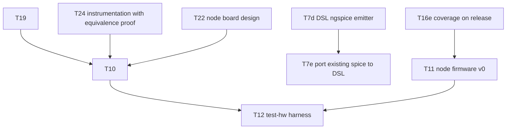

# KANBAN

The **single home for planned work** — the execution view over oparroy's
planning. Each card carries its own description; IDEAS.md is the
not-yet-ready stash, and DESIGN.md holds settled design decisions and
open design questions. When ordering matters, KANBAN wins.

Dormant in spirit until the project opens up, but cards are written in
final form from day one so pickup works the same then as now.

Each card is a **vertical slice** — thin end-to-end through the layers it
touches (DSL → firmware → board → test), completable as one change.
Cards that aren't slices (a DESIGN decision, research, a chore) carry a
**`Shape:`** tag so the picker knows.

## How to pick up work

1. Take the top card in **Next** that fits your context. Next is the set
   of cards with no unbuilt blockers; within Next, higher = higher
   leverage.
1. The change that ships a card **deletes the card** from this file —
   shipped cards are dropped, not moved into a Done column (git history
   is the durable archive). There is no In Progress column either.
1. On shipping, promote any newly-unblocked Backlog card into **Next**.

**If a card grows beyond one change, split it first** (T##a, T##b, …).
Never leave a card half-landed.

## Dependency graph

Critical paths only — every card also carries its own
`Blocked by:`/`Unblocks:`.

______________________________________________________________________

## Next

- **T24 — DSL instrumentation transforms with reset-state equivalence.**
  The CI board is the node design plus injected controllability and
  observability (§6: fault-injection muxes, supervisor-override muxes,
  sense taps) — and that makes it *dangerously different* from the
  plain node it is meant to exercise (raised 2026-09-27). Capture
  instrumentation as an **explicit transformation** of the
  uninstrumented design — insert a series switch on this net, hang a
  sense tap off that one — never a hand-maintained second capture, so
  the two can never drift. The checker then proves the instrumented
  board **in reset state** is equivalent to the plain board: every
  inserted series element in its default/pass-through state reduces to
  a wire (net merge), every tap is high-impedance, no base part or net
  is lost, and residual differences (the series element's on-resistance
  in the §2 decode-margin budget, tap capacitance on the §6 short-stub
  contract) are enumerated and budgeted, not assumed away. "Almost
  equivalent" is exactly the set of those enumerated residuals.
  **Blocked by:** — · **Unblocks:** T10
- **T22 — Node board design.** The single ring node as its own small
  board, designed **before** the CI board — the CI board is eight of
  these tiles plus a supervisor (DESIGN.md §6). Full node circuit
  captured in the DSL: CH32V003 + PHY front-end (§2), charge-pump
  watchdog (§4), status LEDs (§4.1), terminal protection (§7
  checklist), two segment connectors (§3 pinout — the T7bb
  `design/segment.py` block); layout in KiCad, fabbed via JLCPCB (§6).
  Settles the node-board stackup question (§9). First exercise of the
  whole capture→layout round trip: footprint assignment and annotation
  stages, real pcbnew netlist ingest (the T7a caveat, §7), and
  back-annotation so refdes numbering follows physical placement (§7).
  **Blocked by:** — · **Unblocks:** T10
- **T19 — DSL layout property checker.** Parse `.kicad_pcb` and assert
  layout-level properties (DESIGN.md §7): bypass-path copper
  independence, LED-adjacent-to-connector placement contracts,
  net-class width/clearance compliance, trace-length budgets (feeds
  T15), mechanical contracts (min corner radius for handling,
  standoff mounting holes + keepouts, stackup contract — layer count
  and board thickness per §6/§9), board-level checklist
  conformance (power LED present, silkscreen board-ID fields —
  project/PCB name, author, date, version tied to git tag,
  handwritten serial-number box, CI-board protection subcircuit
  instantiated). Includes emitting net
  classes/keepouts into the
  `.kicad_pcb` so KiCad guides layout toward compliance pre-audit.
  T7ba's hierarchical refdes/sheetpath metadata is the channelization
  hook: one instance's layout replicates across the rest.
  **Blocked by:** — · **Unblocks:** T10
- **T7c — DSL parts DB with assembler-stock status.** One record per
  part: LCSC number, JLCPCB Basic/Extended tier, stock count with as-of
  date, KiCad symbol/footprint pair, spice model binding, datasheet
  pointer into `datasheets/`. A freshness check flags stale stock
  entries (§6: part selection is inventory-driven); feeds T8's
  unsourcable-part check. The emitter resolves parts from the DB,
  replacing the ad-hoc declarations of T7a. Selection is **constraint
  filtering over the table**, not a lookup: filter knobs as refinement
  data — min footprint area, excluded parts (stock-out), required part,
  required footprints (PolymorphicBlocks steal, 2026-09-27);
  assembler-stock status is a column *and* a checkable constraint.
  **Blocked by:** — ·
  **Unblocks:** —
- **T7d — DSL ngspice emitter.** Simulation-netlist backend over the
  T7a IR: emits the DUT netlist (`.subckt` wrappers matching the
  hand-written interfaces in `circuits/`), with spice model bindings
  declared ad hoc until T7c's parts DB owns them. Boundary: stimulus
  and `.meas` assertions stay in external bench decks — the DSL emits
  the circuit, benches drive it — so today's benches run unmodified
  against either capture. **Blocked by:** — · **Unblocks:** T7e
- **T8 — DSL constraint checking / property verification.** Electrical
  rules beyond KiCad ERC: bypass-path continuity under single-fault
  models, watchdog default-state assertions. Typed ports carry
  voltage/current-limit **ranges**; checks are interval containment —
  a sink's acceptable range must cover the connected source's output
  range — so tolerance stackup becomes checkable (PolymorphicBlocks
  steal, 2026-09-27). Waivers are explicit, path-addressed data in the
  capture — auditable in review — never comment-style suppression.
  **Blocked by:** — ·
  **Unblocks:** —
- **T9 — Firmware header generation from the DSL.** Pin maps and
  peripheral assignments emitted for the CH32V003 (DESIGN.md §5).
  Captures request pins by function (`gpio.request("keepalive")`),
  pin numbers bind late as refinement data — one authoritative pin
  table feeds both this generator and the §5 GPIO-budget check
  (PolymorphicBlocks steal, 2026-09-27). **Blocked by:** — ·
  **Unblocks:** T11
- **T16e — Coverage measured on the release build.** SQLite doctrine
  (§8): branch coverage of the freestanding *release* configuration —
  tests exercise what actually ships — wired as a script target in the
  flake shell. **Blocked by:** — · **Unblocks:** T11
- **T13 — Intermittent-fault strategy.** *Shape: decision.* Protocol
  re-route vs hardware auto-bypass vs both (DESIGN.md §3). T5's
  detection hooks: supervisor frame-echo comparison, illegal-cell
  detection, and the pull-down-parked idle-low segment (§2 measured
  block). **Blocked by:** — · **Unblocks:** —
- **T15 — Characterize cable reach.** *Shape: research.* Maximum
  segment length unamplified, and with an amplifier/re-driver in the
  segment (DESIGN.md §9). ngspice over cable models first (RLGC of a
  candidate cable, capacitive load per node) — build on
  `circuits/phy-segment/` (swap the lumped segment for the RLGC line;
  T5's lumped-C baseline is benign: margins flat to 1 nF, but keep
  far-end edge rates within what tb_noise covered or rerun it) — then
  long-cable measurement on the test board. Output: numbers +
  amplifier guidance in DESIGN.md §2. **Blocked by:** — ·
  **Unblocks:** —
- **T21 — Prior-art review: automatic schematic generation.** *Shape:
  research.* Survey how existing tools turn netlists into readable
  schematics — netlistsvg, yosys `show`, SKiDL's schematic generation,
  KiCad's netlist-import placement, commercial ESL auto-drawing — and
  the graph-drawing literature underneath (layered/Sugiyama layout,
  orthogonal routing). The goal is abstraction-level block views for
  design review (DESIGN.md §7 DSL shape): decide what oparroy's views
  should look like beyond T7a's dot dump, and what we build vs borrow.
  Output: findings in `docs/`. **Blocked by:** — · **Unblocks:** —
- **T25 — Project-owned unit-test harness.** AK LibTest-style (raised
  in PR #17 review, 2026-09-28): `TEST_CASE`/`EXPECT` macros over a
  tiny report hook — failure index as exit code freestanding,
  `write(2)` + manual itoa on host, so no hosted header enters the
  tree (code-std.md §2) and tests keep compiling against the shipped
  freestanding configuration (T16e's test-what-ships doctrine).
  Packaged frameworks fail that bar: gtest/Catch2/doctest need
  exceptions, RTTI, or a hosted runtime, and a per-target flag fork
  for tests is exactly the test-build-vs-shipped-build split the
  doctrine rejects; snitch is the packaged fallback if the harness
  outgrows maintenance-in-house. First consumer: port
  `firmware/lib/test_foundation.cpp`'s hand-rolled exit-code checks
  into named cases that read as usage examples — §12's
  examples-first doctrine, C++ side. The report hook takes the same
  wiring-point shape as `lib::verify_failed`: target-side reporting
  over the debug transport lands with T11/T12. **Blocked by:** — ·
  **Unblocks:** —

## Backlog

- **T7bd — DSL connection sugar.** Split out of T7b (2026-09-28); added
  only as the flat style proves tedious: `chain()` over
  `Input`/`Output`/`InOut`-tagged ports (the ring *is* a chain; `InOut`
  is the tapped RX-in-bypass semantics, §4) — requires port direction
  tags on T7ba's ports — named connections naming nets, a
  lexically-scoped `with`-block for implicit power/ground (scope stays
  explicit — the no-implicit-global-circuit rule holds). **Blocked
  by:** — · **Unblocks:** —
- **T7e — Port existing spice captures to the DSL.** Re-capture the DUT
  netlists of `circuits/phy-segment/`, `circuits/watchdog-chargepump/`,
  and `circuits/watchdog-supervisor/` in the DSL, with equivalence
  tests: the existing benches run against the DSL-emitted netlists and
  reproduce the measured numbers recorded in DESIGN.md §2/§4. Device
  models (`circuits/lib/*.spi`) stay hand-written includes. On
  shipping, the hand-written DUT `.cir` files retire — the DSL becomes
  the single source of truth (§7), not a second copy of it.
  **Blocked by:** T7d · **Unblocks:** —
- **T23 — DSL parametric value resolution.** Computed component values
  carry slack (DESIGN.md §7): the capture states a spec — target plus
  tolerance — and the emitter resolves it to real parts from the parts
  DB's stocked bins: the VDD/2 divider comes out of the 10k bin, never
  an irrational computed number. Includes ratio specs (a divider ratio
  met by any pair from a bin) and reporting the achieved error of the
  chosen values against the spec. Widens `Part.value` from `str` to a
  value-spec type (DESIGN.md §7). Generalizes to **ranges as the
  universal value spec** and **generators** (PolymorphicBlocks steal,
  2026-09-27): a solve pass between capture and check (capture → solve
  → check → emit) where a subcircuit computes its own part values from
  context — the LED sizes its resistor from the actual rail voltage.
  Solving stays a pass over the finished IR, never tangled into
  construction: plain-Python capture semantics hold (PB's `IntLike`
  interleaving is the anti-pattern). **Blocked by:** T7c ·
  **Unblocks:** —
- **T10 — Test board design.** 8 ring nodes + supervisor, full fault
  injection (per-segment open/short, per-node power cut, clock kill),
  all scriptable (DESIGN.md §6). **Dual role — CI + demonstrator**
  (§6): a subset of nodes carries human-facing I/O (potentiometer,
  buttons, LEDs, buzzer), each input overridable from the supervisor
  (mux/DAC substitution, button paralleling) so scripted runs stay
  hands-off regardless of knob positions. Includes the
  **instrumented boundary node**: the supervisor-adjacent node's RX/TX
  ring segments (plus comparator-output and working-LED taps) wired to
  RP2040 GPIOs for PIO logic analysis and glitch stimulus (DESIGN.md
  §6). Nodes tile the T22 node-board design; captured in the DSL,
  layout in KiCad.
  Bela lesson (docs/bela-lessons-2026-09-26.md §5): the test rig is a
  first-class deliverable with its own schedule risk — budget for it,
  and test at the cheapest rework stage (post-SMT, pre-through-hole).
  **Blocked by:** T19, T22, T24 · **Unblocks:** T12
- **T11 — Node firmware v0.** Receive-and-forward ring node on the
  CH32V003; the minimal slice that makes a multi-node ring pass bits.
  Per-bit cut-through forwarding with on-the-fly slot rewrite
  (DESIGN.md §2); bring up store-and-forward first for correctness,
  then switch to cut-through and measure timing closure. Gap-latched
  (vsync) output apply and input sampling per §2's global-shutter
  rule.
  Developed inside the verification harness (T16b–e) from the first
  commit. Trill pattern (docs/bela-lessons-2026-09-26.md §2): aim for
  **one firmware image, personality by node-type ID** — a single HIL
  target. Defines `lib::verify_failed`, the §4 VERIFY failure hook
  whose wiring point T18 landed (2026-09-28): report over the debug
  transport, then stop the keep-alive strobe so the charge-pump
  watchdog engages RX→TX bypass. **Blocked by:** T16e ·
  **Unblocks:** T12
- **T12 — `test-hw` harness.** Local, scriptable test runs against the
  bench board: flash all nodes, inject faults, assert ring behavior.
  CI-platform integration is a later card. **Blocked by:** T10, T11 ·
  **Unblocks:** —
